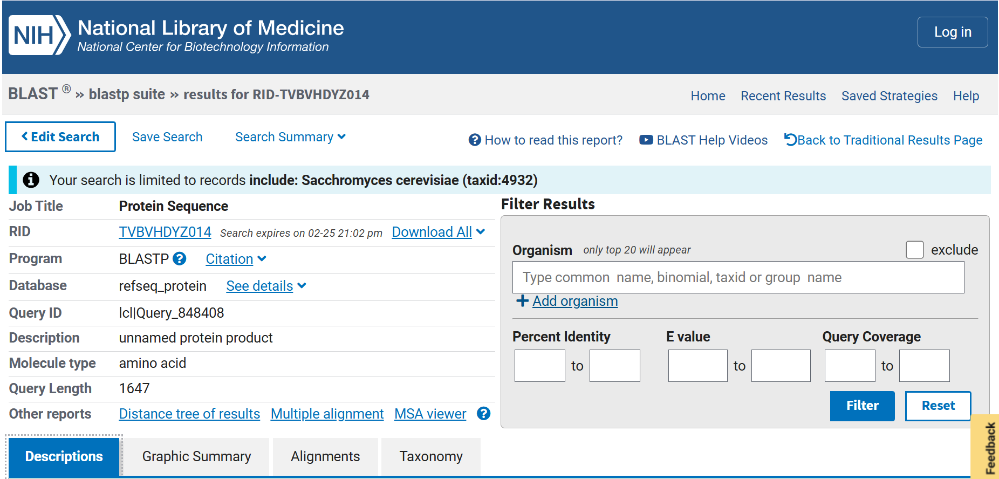
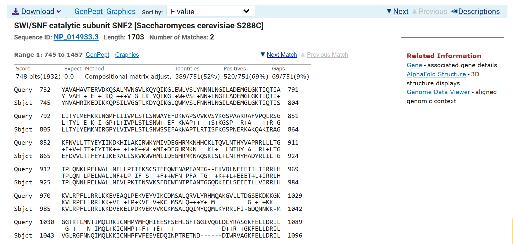
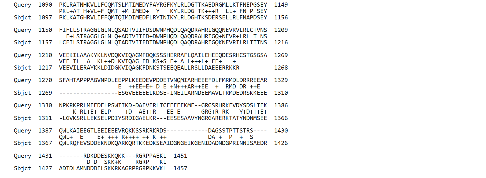
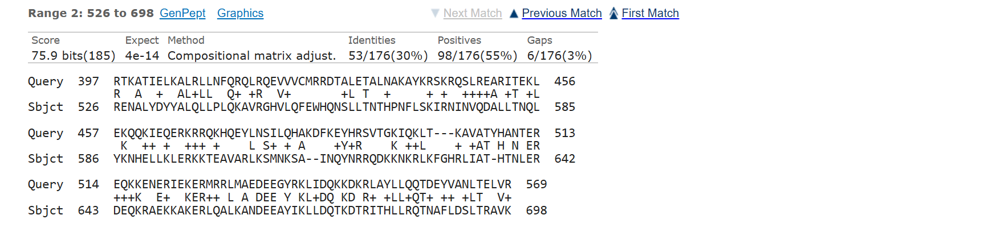
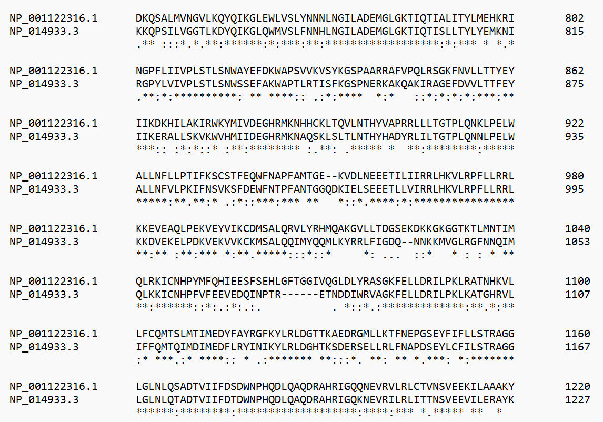
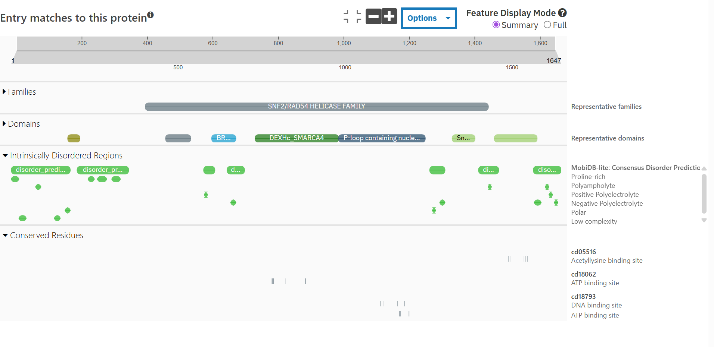
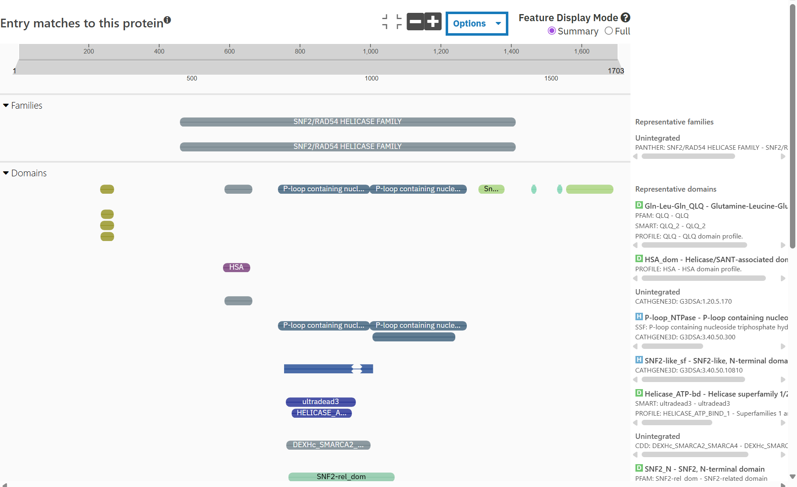
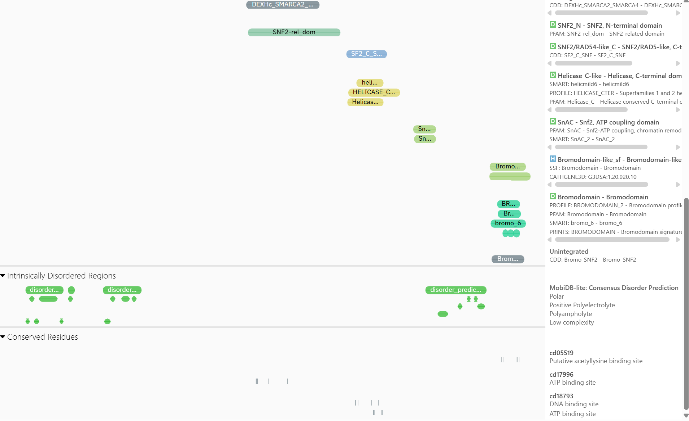

# Comparative Evolutionary and Domain Analysis of SNF2 Family Proteins

## Project Overview

This project investigates the evolutionary conservation and functional domain architecture of chromatin remodeling proteins by comparing:

- Human SMARCA4 (BRG1)
- Yeast SNF2 (Saccharomyces cerevisiae)

SMARCA4 and SNF2 are ATP-dependent chromatin remodeling proteins belonging to the SNF2 helicase family. This project uses sequence similarity, alignment, and domain annotation to identify conserved catalytic regions and understand how chromatin remodeling mechanisms have been preserved through evolution.

---

## Objectives

- Identify evolutionary conservation between human and yeast chromatin remodelers  
- Detect conserved catalytic ATPase regions  
- Compare domain architecture between species  
- Understand functional implications of conserved and divergent regions  

---

## Tools Used

- NCBI BLASTp – sequence similarity analysis  
- Clustal Omega – multiple sequence alignment  
- InterProScan – domain architecture annotation  
- NCBI Protein Database – sequence retrieval  

---

## Workflow Overview

### 1 — Sequence Retrieval

Protein sequences were retrieved from NCBI Protein database:

- Human SMARCA4 (~1647 amino acids)
- Yeast SNF2 (~1703 amino acids)

---

### 2 — BLAST Analysis

BLASTp was used to identify homologous regions between human and yeast proteins.

Key results:

- Query coverage: 54%
- Range 1: 52% identity, E-value = 0.0
- Range 2: 30% identity, E-value = 4e-14

These results indicate strong evolutionary conservation in the ATPase catalytic core.

BLAST evidence:

Alignment Range 1 (Part 1):

Alignment Range 1 (Part 2):

Alignment Range 2:

---

### 3 — Multiple Sequence Alignment

Clustal Omega alignment revealed a highly conserved central region corresponding to the ATP-dependent helicase core.

Key observations:

- Long stretches of identical residues (*)
- Minimal gaps in catalytic core region
- Increased divergence in N-terminal and C-terminal regions

Alignment evidence:

This confirms conservation of the ATP-dependent chromatin remodeling mechanism.

---

### 4 — Domain Architecture Analysis

InterProScan analysis identified conserved functional domains in both proteins.

Human SMARCA4 domains:

- SNF2 helicase family domain
- DEXHc ATPase domain
- P-loop NTP-binding domain
- BRK domain
- Intrinsically disordered regulatory regions

Yeast SNF2 domains:

- SNF2 helicase domain
- DEXHc ATPase domain
- Helicase C-terminal domain
- Bromodomain
- HSA domain

Domain architecture evidence:

Human SMARCA4:

Yeast SNF2:

---

## Biological Interpretation

The ATP-dependent helicase catalytic core is strongly conserved between yeast and humans, indicating preservation of the fundamental chromatin remodeling mechanism across evolution.

Differences in regulatory domains and increased intrinsic disorder in the human protein suggest evolutionary expansion of regulatory complexity in higher eukaryotes.

This supports functional conservation of the chromatin remodeling engine with diversification of regulatory control.

---

## Skills Demonstrated

- Comparative genomics  
- Protein sequence analysis  
- Multiple sequence alignment interpretation  
- Domain architecture analysis  
- Evolutionary reasoning  
- Scientific documentation using GitHub  

---

## Future Work

- Phylogenetic analysis of SNF2 family across species  
- Structural mapping using AlphaFold  
- Functional interaction network analysis  
- Mutation impact analysis  

---

## Author

Bioinformatics self-directed project focused on evolutionary and structural analysis of chromatin remodeling proteins.

---

## Author
Kashi Kumar  
MSc Zoology | Bioinformatics & Molecular Biology Enthusiast  
